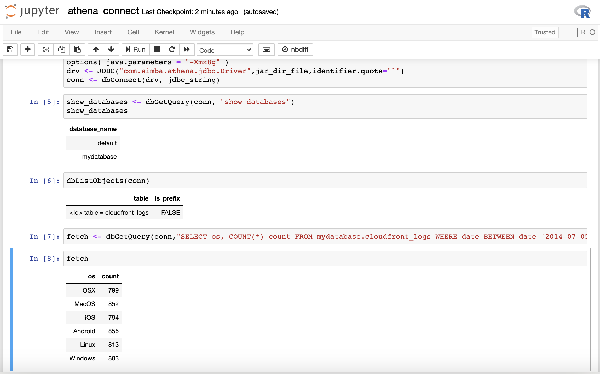

## Connect to Amazon Athena from SageMaker R Kernel

[Amazon Athena](https://aws.amazon.com/athena/?nc2=h_ql_prod_an_ath&whats-new-cards.sort-by=item.additionalFields.postDateTime&whats-new-cards.sort-order=desc) is an interactive query service that makes it easy to analyze data in Amazon S3 using standard SQL. Athena is serverless, so there is no infrastructure to manage, and you pay only for the queries that you run. In order for us to connect to Amazon Athena from Sagemaker R kernel using RJDBC we will utilize the Athena JDBC driver from [here](https://docs.aws.amazon.com/athena/latest/ug/connect-with-jdbc.html) which is already downloaded to the SageMaker Notebook instance as via the Lifecycle Configuration script.

Also you need to set the query result location in S3 as stated [here](https://docs.aws.amazon.com/athena/latest/ug/querying.html). In order to do that, navigate to Athena from AWS Console and click on “Get Started”. You will find a banner notice which will say “Before you run your first query, you need to set up a query result location in Amazon S3”. Click on “set up a query result location in Amazon S3” to step up the result location. Use the S3 location as specified by the value of the key **_“SageMakerRS3BucketName”_** in the CloudFormation Outputs, you may choose to add a prefix of your choice like “results”. Please read more [here](https://docs.aws.amazon.com/athena/latest/ug/getting-started.html) about how to get started with Amazon Athena.

You can follow the example [here](https://docs.aws.amazon.com/athena/latest/ug/getting-started.html) to create a database / schema and table in Athena with the example S3 data. Similar to connecting to Hive, and Presto in EMR from Sagemaker R kernel, in order to establish a connection Amazon Athena to from SageMaker using the R kernel click on “Upload” to upload the notebook below.

* Notebook Viewer : [athena_connect.ipynb](https://nbviewer.jupyter.org/github/aws-samples/amazon-sagemaker-r-kernel-access-data-sources/blob/master/notebooks/athena_connect.ipynb)
* Notebook Link : [athena_connect.ipynb](notebooks/athena_connect.ipynb)

OR Click on “New” and select “R” kernel to open a new SageMaker Notebook and run the above code.

Before running make sure to replace 
* Replace the s3_bucket value with the value from key **_“SageMakerRS3BucketName”_** in the CloudFormation Outputs

Run all the cells in the notebook to make successful connection to Amazon Athena using SageMaker R console as shown below.

