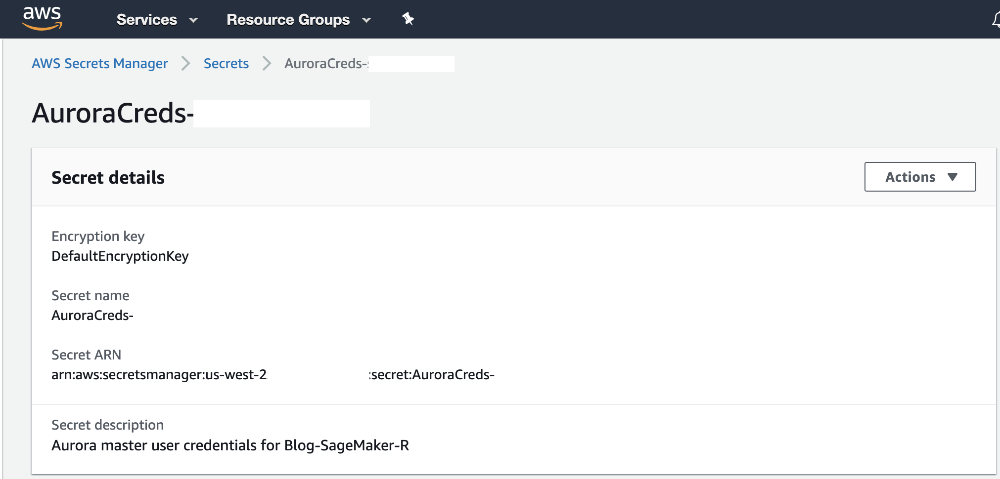

## Connect to Amazon Aurora MySQL from SageMaker R Kernel

[Amazon Aurora](https://aws.amazon.com/rds/aurora/) is a MySQL compatible [relational database](https://aws.amazon.com/relational-database/) built for the cloud, that combines the performance and availability of traditional enterprise databases with the simplicity and cost-effectiveness of open source databases. In order for us to connect to Amazon Aurora from Sagemaker R kernel using RJDBC we will utilize the MariaDB JDBC driver from [here](https://downloads.mariadb.org/connector-java/) which is already downloaded to the SageMaker Notebook instance as via the Lifecycle Configuration script.

We need the following keys and their values from the CloudFormation Outputs to connect to the Aurora Cluster.

| Key | Description |
| :-------------: |:-------------| 
| AuroraClusterDBName | Aurora cluster database name |
| AuroraClusterEndpointWithPort | Aurora cluster endpoint address with port number |
| AuroraClusterSecret | Aurora cluster credentials secret ARN |

The CloudFormation Template creates a secret for the created Aurora Cluster in [AWS Secrets Manager](https://aws.amazon.com/secrets-manager/) which is a service that helps you protect secrets needed to access your applications, services, and IT resources. The service enables you to easily rotate, manage, and retrieve database credentials, API keys, and other secrets throughout their lifecycle.

Navigate to AWS Secrets Manager using the AWS Console to locate the secret as denoted by the **_AuroraClusterSecret_** key value in the CloudFormations Outputs.

Scroll down to the “Secret value” section and click on “Retrieve secret value” to get the “username” and “password” for the Aurora Cluster.

In order to connect to the Aurora Cluster and run a query from the SageMaker R Kernel, navigate to the SageMaker Console and open the notebook as created by the Cloudformation Template. From the SageMaker console, click on the “Notebook instances” under “Notebook”. You can find the name of the notebook as specified by the value of the key **_“SageMakerNotebookName”_**. Under “Actions” click on the link which says “Open Jupyter” and click on “Upload” to upload the notebook below.

<<<<<<< HEAD
* Notebook Viewer : [aurora_connect.ipynb](https://nbviewer.jupyter.org/github/aws-samples/amazon-sagemaker-r-kernel-access-data-sources/blob/master/notebooks/aurora_connect.ipynb)
* Notebook Link : [aurora_connect.ipynb](notebooks/aurora_connect.ipynb)
=======
[aurora_connect.ipynb](notebooks/aurora_connect.ipynb)
>>>>>>> 442a1050c73014ba0703537312009929c040e1e2

OR Click on “New” and select “R” kernel to open a new SageMaker Notebook and run the above code.

Before running make sure to replace 
* Replace the ar_ep_port value with the value from key **_“AuroraClusterEndpointWithPort”_** in the CloudFormation Outputs
* Replace the ar_db value with the value from the key **_“AuroraClusterDBName”_** in the CloudFormation Outputs
* Replace ar_user and ar_password with the Secret Value of Secret Key username and password in the AWS Secrets Manager Secret as denoted by **_“AuroraClusterSecret”_** in the CloudFormation Outputs

Run all the cells in the notebook to make successful connection to Amazon Aurora using SageMaker R console as shown below.

