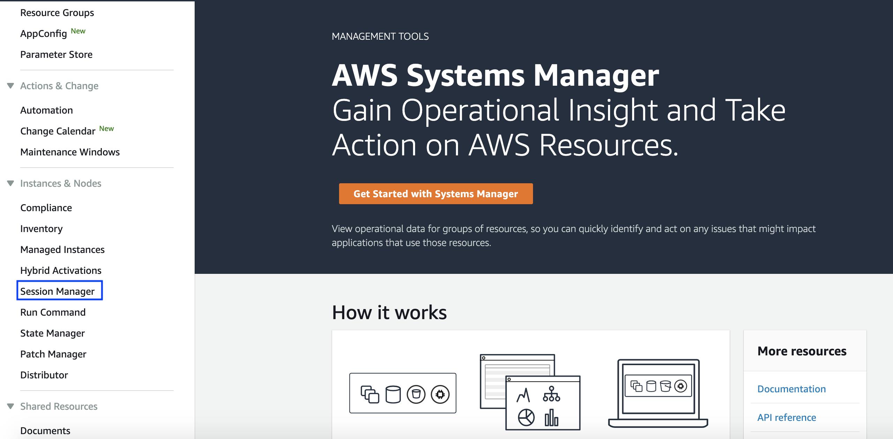
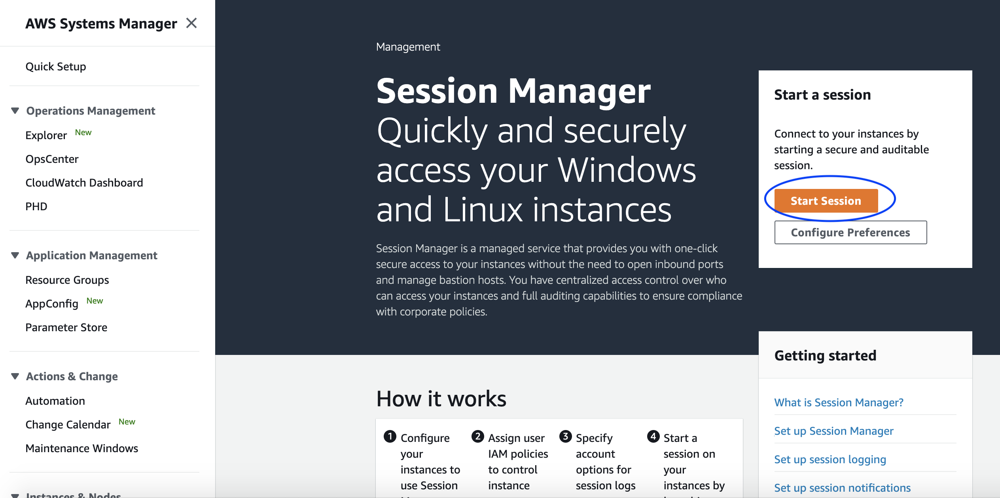
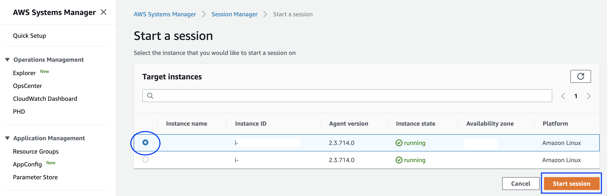
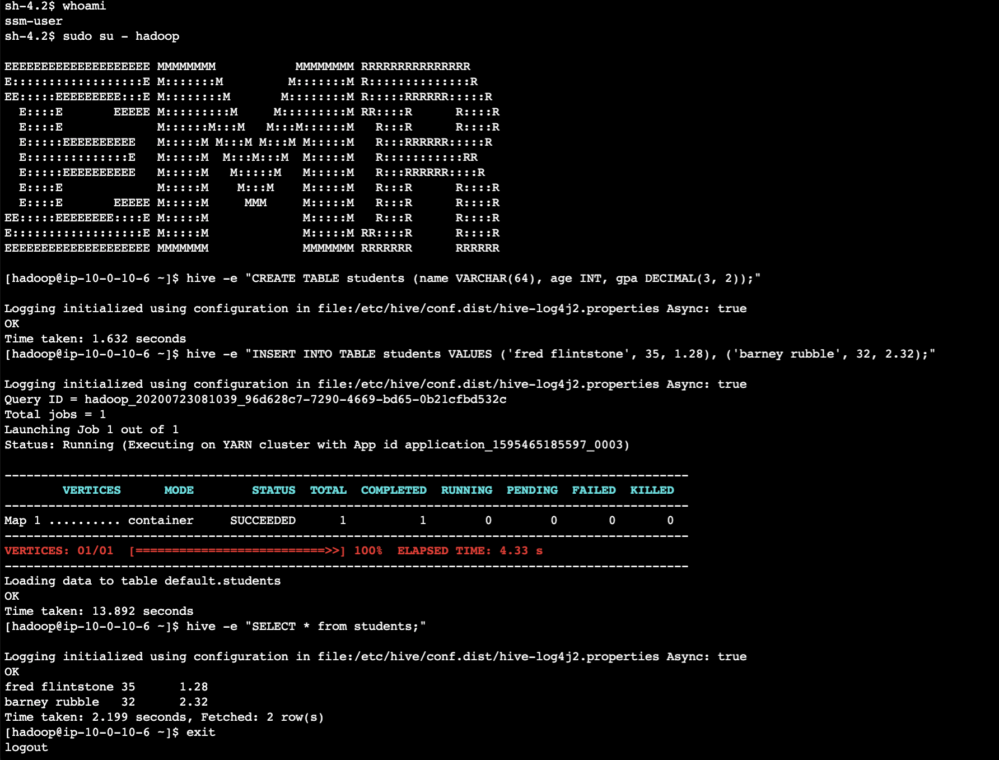
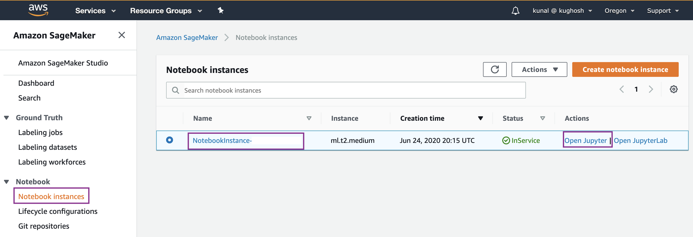
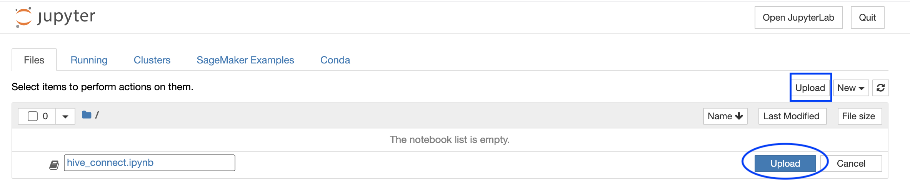
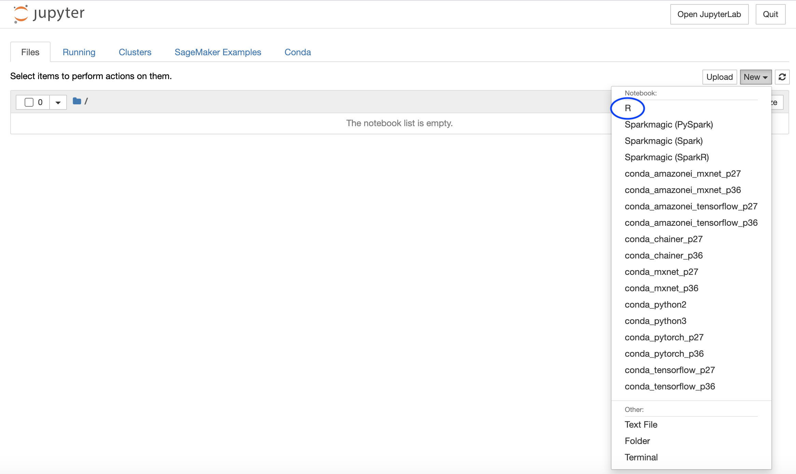
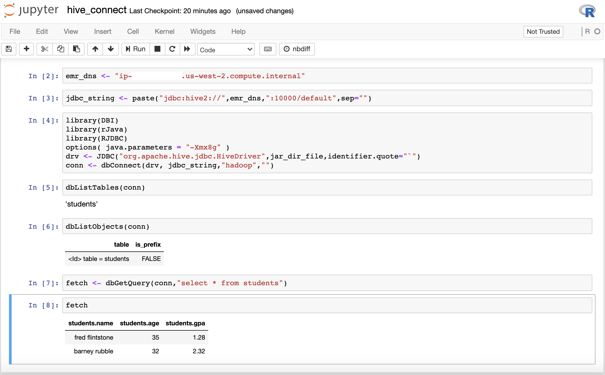
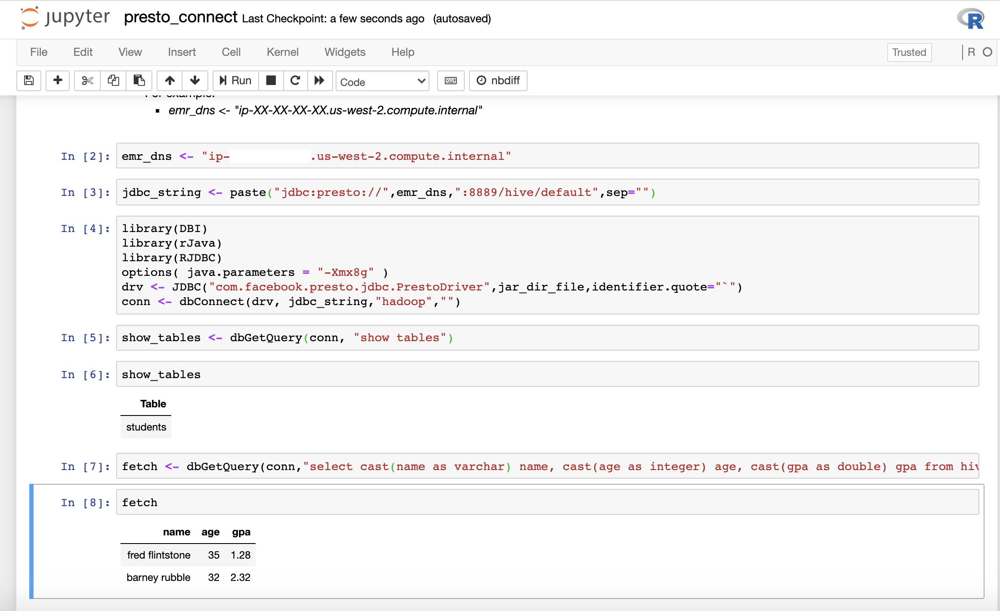

## Connect to Amazon EMR Hive and Presto from SageMaker R Kernel

[Amazon EMR](https://aws.amazon.com/emr/?nc2=h_ql_prod_an_emr&whats-new-cards.sort-by=item.additionalFields.postDateTime&whats-new-cards.sort-order=desc) is the industry-leading cloud big data platform for processing vast amounts of data using open source tools such as [Apache Spark](https://aws.amazon.com/emr/features/spark/), [Apache Hive](https://aws.amazon.com/emr/features/hive/), [Apache HBase](https://aws.amazon.com/emr/features/hbase/), [Apache Flink](https://aws.amazon.com/blogs/big-data/use-apache-flink-on-amazon-emr/), [Apache Hudi](https://aws.amazon.com/emr/features/hudi/), and [Presto](https://aws.amazon.com/emr/features/presto/). You can create a test table in hive by logging on to the EMR master node from the AWS console using the [Session Manager capability of the AWS Systems Manager](https://docs.aws.amazon.com/systems-manager/latest/userguide/session-manager.html). [AWS Systems Manager](https://aws.amazon.com/systems-manager/) gives you visibility and control of your infrastructure on AWS. Systems Manager provides a unified user interface so you can view operational data from multiple AWS services and allows you to automate operational tasks across your AWS resources. Session Manager is a fully managed AWS Systems Manager capability that lets you manage your EC2 instances, on-premises instances, and virtual machines (VMs) through an interactive one-click browser-based shell or through the AWS CLI.

Make a note of the values for the following keys from the CloudFormation Outputs.

| Key | Description |
| :-------------: |:-------------| 
| EMRClusterDNSAddress | EMR cluster dns name |
| EMRMasterInstanceId | EMR cluster master instance id |
| SageMakerNotebookName | SageMaker notebook instance name |	
	
Enter “Systems Manager” in the search bar of the AWS Console to navigate to the [AWS Systems Manager](https://docs.aws.amazon.com/systems-manager/latest/userguide/systems-manager-setting-up.html) page. Locate and click on “Session Manager” on the left pane under “Instances & Nodes” as shown below.



Click on “Start Session” on the Session Manager page as shown below. 



Start an SSH session with the EMR master node by locating the instance id as specified by the value of the key **_“EMRMasterInstanceId”_** from the CloudFormation Outputs as shown below.



This will start the interactive one-click browser-based shell in which you enter the following commands.

```shell
# change user to hadoop 
whoami
sudo su - hadoop
```

Create a test table in hive from the EMR master node as you have already logged in using ssh. 

```shell
# Run in the EMR master node to create a table called students in Hive
hive -e "CREATE TABLE students (name VARCHAR(64), age INT, gpa DECIMAL(3, 2));"

# Run in the EMR master node to insert data to students created above
hive -e "INSERT INTO TABLE students VALUES ('fred flintstone', 35, 1.28), ('barney rubble', 32, 2.32);"

# Verify 
hive -e "SELECT * from students;"
exit
exit
```

This is how it looks in the one-click browser-based shell, close the browser after exiting the shell.



In order for us to query the data from EMR using SageMaker R Kernel, navigate to the SageMaker Console and open the notebook as created by the CloudFormation Template. From the SageMaker console, click on the “Notebook instances” under “Notebook”. You can find the name of the notebook as specified by the value of the key **_“SageMakerNotebookName”_**. Under “Actions” click on the link which says “Open Jupyter” as shown below.



In order to demonstrate connectivity from the SageMaker R Kernel either click on “Upload” to upload the notebook below. 

<<<<<<< HEAD
* Notebook Viewer : [hive_connect.ipynb](https://nbviewer.jupyter.org/github/aws-samples/amazon-sagemaker-r-kernel-access-data-sources/blob/master/notebooks/presto_connect.ipynb)
* Notebook Link : [hive_connect.ipynb](notebooks/hive_connect.ipynb)
=======
[hive_connect.ipynb](notebooks/hive_connect.ipynb)
>>>>>>> 442a1050c73014ba0703537312009929c040e1e2



OR Click on “New” and select “R” kernel to open a new SageMaker Notebook and run the above code.



Before running make sure to replace 
* Replace the emr_dns value with the value from key **_“EMRClusterDNSAddress”_** in the CloudFormation Outputs


Run all the cells in the notebook to make successful connection to Hive on EMR using SageMaker R console as shown below.



Similar to connecting to Hive from Sagemaker R kernel in order for connecting to Presto from SageMaker using the R kernel, navigate to the SageMaker Console and open the notebook as created by the Cloudformation Template. From the SageMaker console, click on the “Notebook instances” under “Notebook”. You can find the name of the notebook as specified by the value of the key **_“SageMakerNotebookName”_**. Under “Actions” click on the link which says “Open Jupyter” and click on “Upload” to upload the notebook below.

[presto_connect.ipynb](notebooks/presto_connect.ipynb)

OR Click on “New” and select “R” kernel to open a new SageMaker Notebook and run the above code.

Before running make sure to replace 
* Replace the emr_dns value with the value from key **_“EMRClusterDNSAddress”_** in the CloudFormation Outputs

Run all the cells in the notebook to make successful connection to PrestoDB on EMR using SageMaker R console as shown below.

