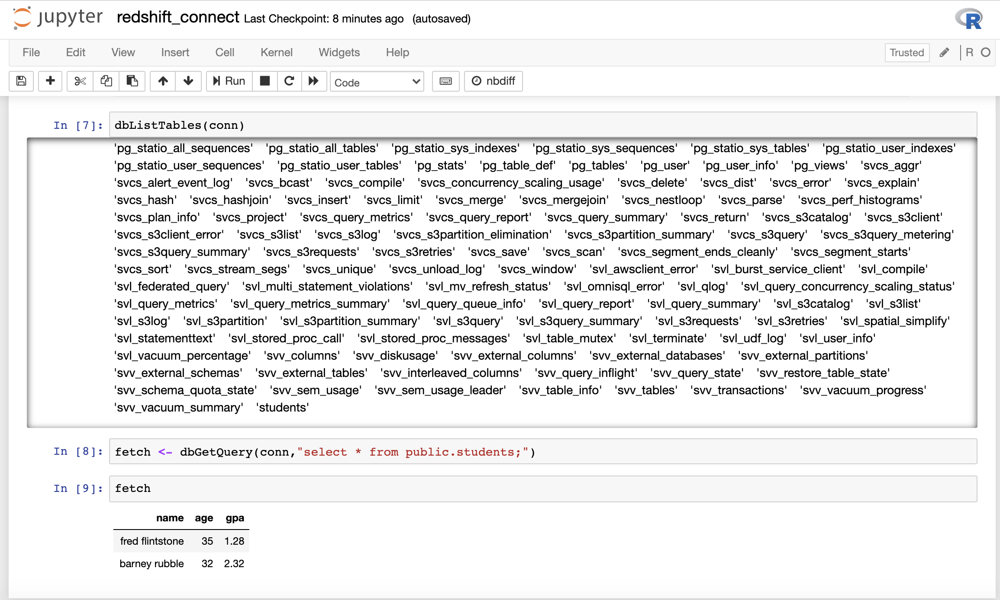

## Connect to Amazon Redshift from SageMaker R Kernel

[Amazon Redshift](https://aws.amazon.com/redshift/?whats-new-cards.sort-by=item.additionalFields.postDateTime&whats-new-cards.sort-order=desc) is a fast, fully managed cloud data warehouse that makes it simple and cost-effective to analyze all your data using standard SQL and your existing Business Intelligence (BI) tools. It allows you to run complex analytic queries against terabytes to petabytes of structured data, using sophisticated query optimization, columnar storage on high-performance storage, and massively parallel query execution. In order for us to connect to Amazon Redshift from Sagemaker R kernel using RJDBC we will utilize the Redshift JDBC driver from [here](https://docs.aws.amazon.com/redshift/latest/mgmt/configure-jdbc-connection.html) which is already downloaded to the SageMaker Notebook instance as via the Lifecycle Configuration script.

We need the following keys and their values from the CloudFormation Outputs.

| Key | Description |
| :-------------: |:-------------| 
| RedshiftClusterDBName | Redshift cluster database name |
| RedshiftClusterEndpointWithPort | Redshift cluster endpoint address with port number |
| RedshiftClusterSecret | Redshift cluster credentials secret ARN |	

As you can see the CloudFormation Template creates a secret for the created Redshift Cluster in [AWS Secrets Manager](https://aws.amazon.com/secrets-manager/) which is a service that helps you protect secrets needed to access your applications, services, and IT resources. The service enables you to easily rotate, manage, and retrieve database credentials, API keys, and other secrets throughout their lifecycle.
Navigate to AWS Secrets Manager using the AWS Console to locate the secret as denoted by the **_RedshiftClusterSecret_** key value in the CloudFormations Outputs.


Scroll down to the “Secret value” section and click on “Retrieve secret value” to get the “username” and “password” for the Redshift Cluster.


Navigate to Redshift console and click on “Editor” from the left panel which is essentially the [Redshift Query Editor](https://docs.aws.amazon.com/redshift/latest/mgmt/query-editor.html) and enter the DB name, username, password and click “Connect to database” to connect to the Redshift cluster.


Run the SQL below to create a table and insert a couple of records.

```sql
CREATE TABLE public.students (name VARCHAR(64), age INT, gpa DECIMAL(3, 2));
INSERT INTO public.students VALUES ('fred flintstone', 35, 1.28), ('barney rubble', 32, 2.32);
```

Navigate to the SageMaker Console to open the notebook as created by the Cloudformation Template in order to connect to the Redshift cluster and query the table created above using the SageMaker R Kernel. From the SageMaker console, click on the “Notebook instances” under “Notebook”. You can find the name of the notebook as specified by the value of the key **_“SageMakerNotebookName”_**. Under “Actions” click on the link which says “Open Jupyter” and click on “Upload” to upload the notebook below.

<<<<<<< HEAD
* Notebook Viewer : [redshift_connect.ipynb](https://nbviewer.jupyter.org/github/aws-samples/amazon-sagemaker-r-kernel-access-data-sources/blob/master/notebooks/redshift_connect.ipynb)
* Notebook Link : [redshift_connect.ipynb](notebooks/redshift_connect.ipynb)
=======
[redshift_connect.ipynb](notebooks/redshift_connect.ipynb)
>>>>>>> 442a1050c73014ba0703537312009929c040e1e2

OR Click on “New” and select “R” kernel to open a new SageMaker Notebook and run the above code.

Before running make sure to replace 
* Replace the rs_ep_port value with the value from key **_“RedshiftClusterEndpointWithPort”_** in the CloudFormation Outputs
* Replace the rs_db value with the value from the key **_“RedshiftClusterDBName”_** in the CloudFormation Outputs
* Replace rs_user and rs_password with the Secret Value of Secret Key username and password in the AWS Secrets Manager Secret as denoted by **_“RedshiftClusterSecret”_** in the CloudFormation Outputs

Run all the cells in the notebook to make successful connection to Amazon Redshift using SageMaker R console as shown below.


