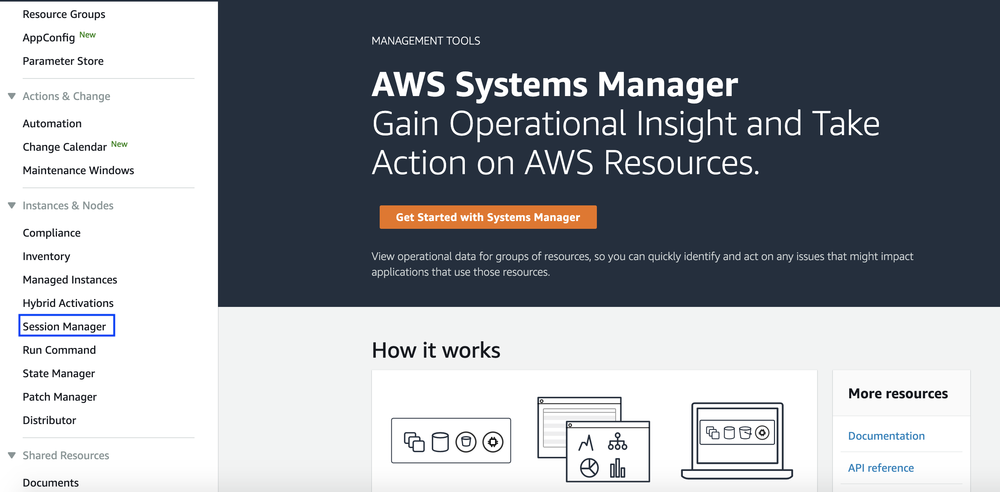
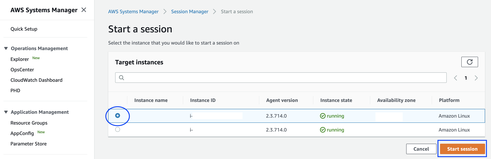
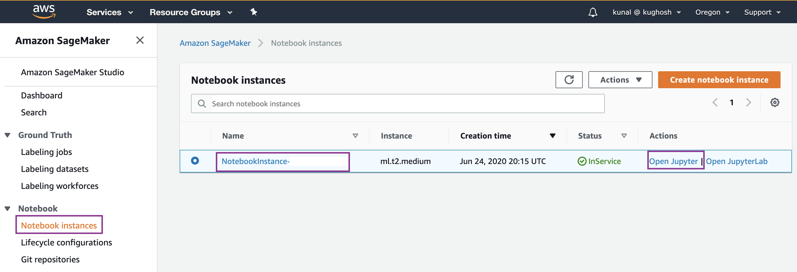
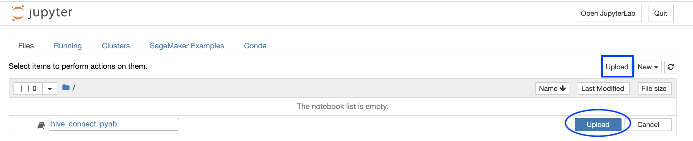
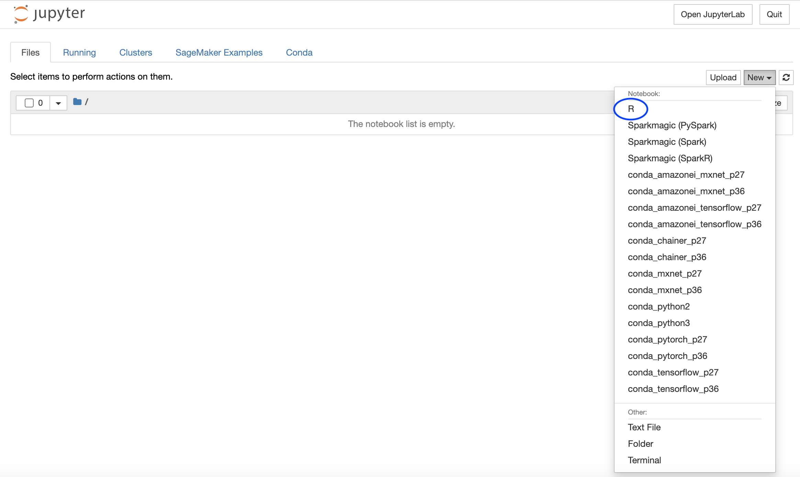
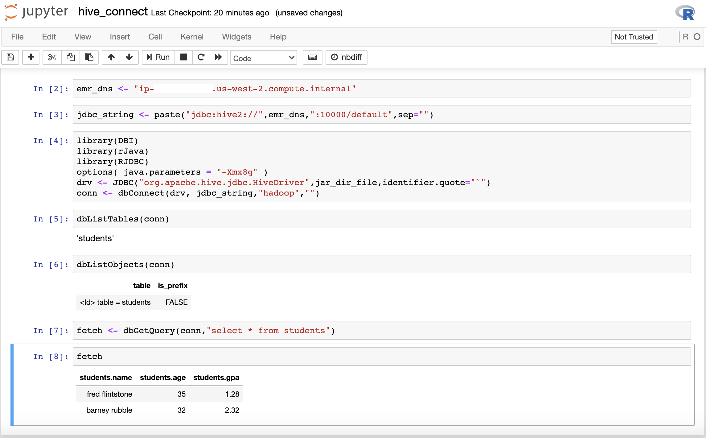
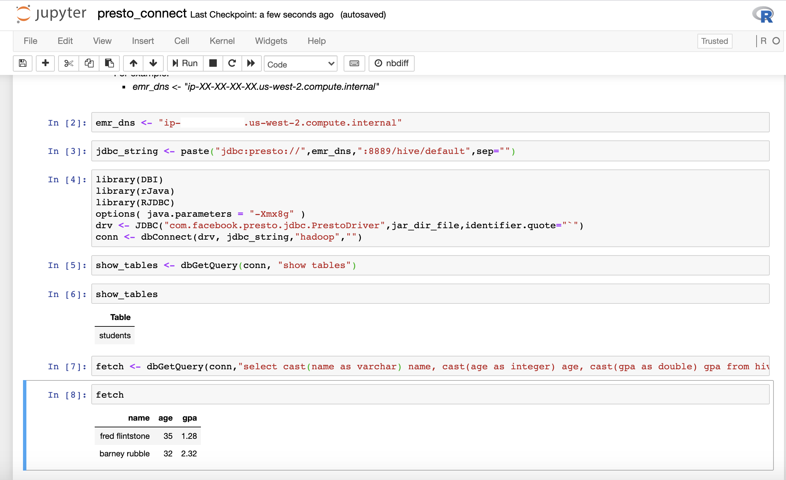

# Access Data Sources from Amazon SageMaker R Kernel

Customers typically find themselves looking for resources to get help around know hows about how to connect to their various data sources from Amazon SageMaker R kernel for their R users. Customers can refer to [R User Guide to Amazon SageMaker](https://docs.aws.amazon.com/sagemaker/latest/dg/r-guide.html) to learn about ways of leveraging Amazon SageMaker features using R. 

Here we show you how to connect to the following data sources from SageMaker R kernel using jdbc.

1.	Amazon EMR Hive
2.	Amazon EMR Presto
3.	Amazon Athena
4.	Amazon Redshift
5.	Amazon Aurora MySQL


* Change the title in this README
* Edit your repository description on GitHub

## Solution Overview

In order for us to build this solution we first need to [create VPC with public and private subnets](https://docs.aws.amazon.com/batch/latest/userguide/create-public-private-vpc.html) to create our own network where we can create resources. Next steps would involve creating 1) Data sources in the custom VPC and 2) Notebook Instance with all necessary configurations in order for the customers to connect various data sources using R program.

Create data sources in the private subnet of the VPC to make sure they are not reachable from the internet. For this exercise we create 
* [Amazon EMR cluster in private subnet with Hive and Presto installed](https://docs.aws.amazon.com/emr/latest/ManagementGuide/emr-gs.html)
* [Amazon Athena resources](https://docs.aws.amazon.com/athena/latest/ug/getting-started.html)
* [Amazon Redshift Cluster in private subnet](https://docs.aws.amazon.com/redshift/latest/gsg/rs-gsg-launch-sample-cluster.html)
* [Amazon Aurora cluster running MySQL in private subnet](https://docs.aws.amazon.com/AmazonRDS/latest/AuroraUserGuide/Aurora.CreateInstance.html)

Connect to Amazon EMR cluster in private subnet using [AWS Systems Manager Session Manager](https://docs.aws.amazon.com/systems-manager/latest/userguide/session-manager.html) to create Hive tables in the EMR cluster. 

In order for us to execute code using the R kernel in Amazon SageMaker, create an Amazon SageMaker notebook. [Create a lifecycle configuration for the notebook](https://docs.aws.amazon.com/sagemaker/latest/dg/notebook-lifecycle-config.html) containing the set up script for R packages and JDBC drivers for the data sources and attach the lifecycle configuration to the Sagemaker notebook on start to make sure the set up in complete.

Finally we can use the AWS management console to navigate to the SageMaker Notebook to run code using the R kernel in order to access the data from various sources.

## Solution Architecture

The following architecture diagram shows how users can use the AWS management console to use the Amazon SageMaker to run code using the R Kernel in order to establish connectivity to various sources. They can also use AWS management console to use the Redshift query editor or Athena query editor to create data resources. Users need to use the AWS Systems Manager Session Manager to SSH to the EMR cluster in order to create Hive resources.


## Pre-requisites
- [Create AWS Account](https://aws.amazon.com/premiumsupport/knowledge-center/create-and-activate-aws-account/)
- Familiarity with [Amazon SageMaker](https://aws.amazon.com/sagemaker/) or [Jupyter](https://jupyter.org/), and [R](https://www.r-project.org/)

## CloudFormation Template

In order to automate the creation of resources you run the [AWS CloudFormation](https://aws.amazon.com/cloudformation/) template to create all the AWS resources. The cloudformation template gives you the option to choose if you want to create an EMR cluster or Redhsift cluster or Aurora MySQL cluster as opposed to doing it all. It might take a few minutes to create all resources. Below is the link to the CloudFormation template, which can create the required AWS resources to launch this solution in your AWS Account.
 
        
   [](https://console.aws.amazon.com/cloudformation/home#/stacks/create/template?stackName=Blog-SageMaker-R&templateURL=https://aws-ml-blog.s3.amazonaws.com/artifacts/SageMaker-R-Connect-Data-Sources/CloudFormation/cft.yaml)

This will take you to “Create stack” page, then click “Next”.


Enter the “Stack name”, and you may choose to change the default values for the rest of the stack details as stated below.

| Stack Details | Default Values |
| :------------- |:-------------:| 
| Choose Second Octet for Class B VPC Address (10.xxx.0.0/16) | 0 |
| SageMaker Jupyter Notebook Instance Type | ml.t2.medium |
| Create EMR Cluster Automatically? | "Yes" |
| Create Redshift Cluster Automatically? | "Yes" |
| Create Aurora MySQL DB Cluster Automatically? | "Yes" |
 
Clicking “Next” will take you to “Step 3 : Configure stack options”,  scroll to the bottom of the page to click “Next” to take us to the page.

The final Step 4 : Review, after reviewing scroll to the bottom of the page to “Capabilities” to check on “I acknowledge that AWS CloudFormation might create IAM resources.” and click on “Create stack”.


After clicking “Create stack” you will see the stack getting created as shown below.


After the stack creation completes we will be able to a see a status of “CREATE_COMPLETE” for the CloudFormation stack as shown below.


Make a note of the Keys and their corresponding values by clicking on the “Outputs” tab.


Make a note of the values for the following keys which is required for the rest of the blog.


| Key | Description |
| :-------------: |:-------------| 
| AuroraClusterDBName | Aurora cluster database name |
| AuroraClusterEndpointWithPort | Aurora cluster endpoint address with port number |
| AuroraClusterSecret | Aurora cluster credentials secret ARN |
| EMRClusterDNSAddress | EMR cluster dns name |
| EMRMasterInstanceId | EMR cluster master instance id |
| PrivateSubnets | Private subnet(s) |
| PublicSubnets | Public subnet(s) |
| RedshiftClusterDBName | Redshift cluster database name |
| RedshiftClusterEndpointWithPort | Redshift cluster endpoint address with port number |
| RedshiftClusterSecret | Redshift cluster credentials secret ARN |	
| SageMakerNotebookName | SageMaker notebook instance name |	
| SageMakerRS3BucketName | SageMaker S3 data bucket |
| VPCandCIDR | VPC ID and CIDR block |	
	
## SageMaker Notebook created with necessary R packages and jar files

[Java Database Connectivity (JDBC)](https://en.wikipedia.org/wiki/Java_Database_Connectivity) is an [application programming interface (API)](https://en.wikipedia.org/wiki/Application_programming_interface) for the programming language [Java](https://en.wikipedia.org/wiki/Java_(programming_language)), which defines how a client may access a [database](https://en.wikipedia.org/wiki/Database). [RJDBC](https://cran.r-project.org/web/packages/RJDBC/index.html) is a package in R which allows the connectivity to various data sources using the JDBC interface. The [lifecycle configuration](https://docs.aws.amazon.com/sagemaker/latest/dg/notebook-lifecycle-config.html) of the notebook instance created by the cloudformation template makes sure that the necessary jar files Hive, Presto, Athena, Redhsift and MySQL are present in order to establish a JDBC connection.

Navigate to SageMaker page and click on Notebook Instances and search on the Notebook name specified by the CloudFormation Output key “SageMakerNotebookName” to locate the right notebook. 


Click on the notebook instance and locate the [lifecycle configuration](https://docs.aws.amazon.com/sagemaker/latest/dg/notebook-lifecycle-config.html) attached as shown below.  A lifecycle configuration allows you to install packages or sample notebooks on your notebook instance, configure networking and security for it, or otherwise use a shell script to customize it. A lifecycle configuration provides shell scripts that run only when you create the notebook instance or whenever you start one.


On the Lifecycle configuration page you will be able to view the script attached to the notebook.


If you click on the “View script” you be able to see the [Lifecycle Configuration Script](lc_scripts/SageMaker_LC_Script.sh) which sets up the R kernel in SageMaker in order to make JDBC connections to data sources using R. It sets up the following in the SageMaker Notebook

*	Installs [RJDBC package and dependencies in the Anaconda environment](https://anaconda.org/r/r-rjdbc)
*	Creates a directory called “jdbc” under home(/home/ec2-user) to download the jar files for various data sources
*	Downloads jar for [Hive](https://mvnrepository.com/artifact/org.apache.hive/hive-jdbc/2.3.6), [Presto](https://prestodb.io/download.html), [Amazon Athena](https://docs.aws.amazon.com/athena/latest/ug/connect-with-jdbc.html), [Amazon Redshift](https://docs.aws.amazon.com/redshift/latest/mgmt/configure-jdbc-connection.html), [Aurora MySQL](https://downloads.mariadb.org/connector-java/)

### 1. Connect to Amazon EMR Hive and Presto from SageMaker R Kernel

[Amazon EMR](https://aws.amazon.com/emr/?nc2=h_ql_prod_an_emr&whats-new-cards.sort-by=item.additionalFields.postDateTime&whats-new-cards.sort-order=desc) is the industry-leading cloud big data platform for processing vast amounts of data using open source tools such as [Apache Spark](https://aws.amazon.com/emr/features/spark/), [Apache Hive](https://aws.amazon.com/emr/features/hive/), [Apache HBase](https://aws.amazon.com/emr/features/hbase/), [Apache Flink](https://aws.amazon.com/blogs/big-data/use-apache-flink-on-amazon-emr/), [Apache Hudi](https://aws.amazon.com/emr/features/hudi/), and [Presto](https://aws.amazon.com/emr/features/presto/). You can create a test table in hive by logging on to the EMR master node from the AWS console using the [Session Manager capability of the AWS Systems Manager](https://docs.aws.amazon.com/systems-manager/latest/userguide/session-manager.html). [AWS Systems Manager](https://aws.amazon.com/systems-manager/) gives you visibility and control of your infrastructure on AWS. Systems Manager provides a unified user interface so you can view operational data from multiple AWS services and allows you to automate operational tasks across your AWS resources. Session Manager is a fully managed AWS Systems Manager capability that lets you manage your EC2 instances, on-premises instances, and virtual machines (VMs) through an interactive one-click browser-based shell or through the AWS CLI.

Make a note of the values for the following keys from the CloudFormation Outputs.

| Key | Description |
| :-------------: |:-------------| 
| EMRClusterDNSAddress | EMR cluster dns name |
| EMRMasterInstanceId | EMR cluster master instance id |
| SageMakerNotebookName | SageMaker notebook instance name |	
| SageMakerRS3BucketName | SageMaker S3 data bucket |
	
Enter “Systems Manager” in the search bar of the AWS Console to navigate to the [AWS Systems Manager](https://docs.aws.amazon.com/systems-manager/latest/userguide/systems-manager-setting-up.html) page. Locate and click on “Session Manager” on the left pane under “Instances & Nodes” as shown below.



Click on “Start Session” on the Session Manager page as shown below. 


Start an SSH session with the EMR master node by locating the instance id as specified by the value of the key “EMRMasterInstanceId” from the CloudFormation Outputs as shown below.



This will start the interactive one-click browser-based shell in which you enter the following commands.

```shell
# change user to hadoop 
whoami
sudo su - hadoop
```

Create a test table in hive from the EMR master node as you have already logged in using ssh. 

```shell
# Run in the EMR master node to create a table called students in Hive
hive -e "CREATE TABLE students (name VARCHAR(64), age INT, gpa DECIMAL(3, 2));"

# Run in the EMR master node to insert data to students created above
hive -e "INSERT INTO TABLE students VALUES ('fred flintstone', 35, 1.28), ('barney rubble', 32, 2.32);"

# Verify 
hive -e "SELECT * from students;"
exit
```

This is how it looks in the one-click browser-based shell, close the browser after exiting the shell.


In order for us to query the data from EMR using SageMaker R Kernel, navigate to the SageMaker Console and open the notebook as created by the CloudFormation Template. From the SageMaker console, click on the “Notebook instances” under “Notebook”. You can find the name of the notebook as specified by the value of the key “SageMakerNotebookName”. Under “Actions” click on the link which says “Open Jupyter” as shown below.



In order to demonstrate connectivity from the SageMaker R Kernel either click on “Upload” to upload the notebook below. 

[hive_connect.ipynb](notebooks/hive_connect.ipynb)



OR Click on “New” and select “R” kernel to open a new SageMaker Notebook and run the above code.



Before running make sure to replace 
* Replace the emr_dns value with the value from key “EMRClusterDNSAddress” in the CloudFormation Outputs


Run all the cells in the notebook to make successful connection to Hive on EMR using SageMaker R console as shown below.



Similar to connecting to Hive from Sagemaker R kernel in order for connecting to Presto from SageMaker using the R kernel, navigate to the SageMaker Console and open the notebook as created by the Cloudformation Template. From the SageMaker console, click on the “Notebook instances” under “Notebook”. You can find the name of the notebook as specified by the value of the key “SageMakerNotebookName”. Under “Actions” click on the link which says “Open Jupyter” and click on “Upload” to upload the notebook below.

[presto_connect.ipynb](notebooks/presto_connect.ipynb)

OR Click on “New” and select “R” kernel to open a new SageMaker Notebook and run the above code.

Before running make sure to replace 
* Replace the emr_dns value with the value from key “EMRClusterDNSAddress” in the CloudFormation Outputs

Run all the cells in the notebook to make successful connection to PrestoDB on EMR using SageMaker R console as shown below.




### 2. Connect to Amazon Athena from SageMaker R Kernel

## Code of Conduct

See [CODE_OF_CONDUCT](CODE_OF_CONDUCT.md) for more information.

## Contributing Guidelines

See [CONTRIBUTING](CONTRIBUTING.md#security-issue-notifications) for more information.

## License

This library is licensed under the MIT-0 License. See the LICENSE file.

