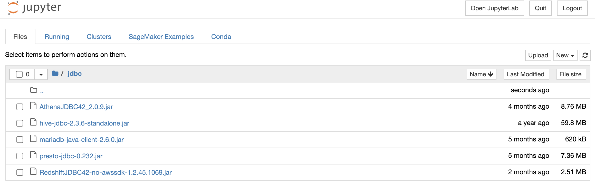

# Access Data Sources from Amazon SageMaker R Kernel

Customers typically find themselves looking for resources to get help around know hows about how to connect to their various data sources from Amazon SageMaker R kernel for their R users. Customers can refer to [R User Guide to Amazon SageMaker](https://docs.aws.amazon.com/sagemaker/latest/dg/r-guide.html) to learn about ways of leveraging Amazon SageMaker features using R. 

Here we show you how to connect to the following data sources from SageMaker R kernel using jdbc.

1.	Amazon EMR Hive
2.	Amazon EMR Presto
3.	Amazon Athena
4.	Amazon Redshift
5.	Amazon Aurora MySQL

## Solution Overview

In order for us to build this solution we first need to [create VPC with public and private subnets](https://docs.aws.amazon.com/batch/latest/userguide/create-public-private-vpc.html) to create our own network where we can create resources. Next steps would involve creating 1) Data sources in the custom VPC and 2) Notebook Instance with all necessary configurations in order for the customers to connect various data sources using R program.

Create data sources in the private subnet of the VPC to make sure they are not reachable from the internet. For this exercise we create 
* [Amazon EMR cluster in private subnet with Hive and Presto installed](https://docs.aws.amazon.com/emr/latest/ManagementGuide/emr-gs.html)
* [Amazon Athena resources](https://docs.aws.amazon.com/athena/latest/ug/getting-started.html)
* [Amazon Redshift Cluster in private subnet](https://docs.aws.amazon.com/redshift/latest/gsg/rs-gsg-launch-sample-cluster.html)
* [Amazon Aurora cluster running MySQL in private subnet](https://docs.aws.amazon.com/AmazonRDS/latest/AuroraUserGuide/Aurora.CreateInstance.html)

Connect to Amazon EMR cluster in private subnet using [AWS Systems Manager Session Manager](https://docs.aws.amazon.com/systems-manager/latest/userguide/session-manager.html) to create Hive tables in the EMR cluster. 

In order for us to execute code using the R kernel in Amazon SageMaker, create an Amazon SageMaker notebook. Download the JDBC drivers for the data sources. [Create a lifecycle configuration for the notebook](https://docs.aws.amazon.com/sagemaker/latest/dg/notebook-lifecycle-config.html) containing the set up script for R packages, and attach the lifecycle configuration to the Sagemaker notebook on start to make sure the set up in complete.

Finally we can use the AWS management console to navigate to the SageMaker Notebook to run code using the R kernel in order to access the data from various sources.

## Solution Architecture

The following architecture diagram shows how users can use the AWS management console to use the Amazon SageMaker to run code using the R Kernel in order to establish connectivity to various sources. They can also use AWS management console to use the Redshift query editor or Athena query editor to create data resources. Users need to use the AWS Systems Manager Session Manager to SSH to the EMR cluster in order to create Hive resources.

## Pre-requisites
- [Create AWS Account](https://aws.amazon.com/premiumsupport/knowledge-center/create-and-activate-aws-account/)
- Familiarity with [Amazon SageMaker](https://aws.amazon.com/sagemaker/) or [Jupyter](https://jupyter.org/), and [R](https://www.r-project.org/)

## CloudFormation Template

In order to automate the creation of resources you run the [AWS CloudFormation](https://aws.amazon.com/cloudformation/) template to create all the AWS resources. The cloudformation template gives you the option to choose if you want to create an EMR cluster or Redhsift cluster or Aurora MySQL cluster as opposed to doing it all. It might take a few minutes to create all resources. Below is the link to the CloudFormation template, which can create the required AWS resources to launch this solution in your AWS Account.
 
        
   

This will take you to “Create stack” page, then click “Next”.

Enter the “Stack name”, and you may choose to change the default values for the rest of the stack details as stated below.

| Stack Details | Default Values |
| :------------- |:-------------:| 
| Choose Second Octet for Class B VPC Address (10.xxx.0.0/16) | 0 |
| SageMaker Jupyter Notebook Instance Type | ml.t2.medium |
| Create EMR Cluster Automatically? | "Yes" |
| Create Redshift Cluster Automatically? | "Yes" |
| Create Aurora MySQL DB Cluster Automatically? | "Yes" |
 
Clicking “Next” will take you to “Step 3 : Configure stack options”,  scroll to the bottom of the page to click “Next” to take us to the page.

The final Step 4 : Review, after reviewing scroll to the bottom of the page to “Capabilities” to check on “I acknowledge that AWS CloudFormation might create IAM resources.” and click on “Create stack”.

After clicking “Create stack” you will see the stack getting created as shown below.

After the stack creation completes we will be able to a see a status of “CREATE_COMPLETE” for the CloudFormation stack as shown below.

Make a note of the Keys and their corresponding values by clicking on the “Outputs” tab.

Make a note of the values for the following keys which is required for the rest of the blog.

| Key | Description |
| :-------------: |:-------------| 
| AuroraClusterDBName | Aurora cluster database name |
| AuroraClusterEndpointWithPort | Aurora cluster endpoint address with port number |
| AuroraClusterSecret | Aurora cluster credentials secret ARN |
| EMRClusterDNSAddress | EMR cluster dns name |
| EMRMasterInstanceId | EMR cluster master instance id |
| PrivateSubnets | Private subnet(s) |
| PublicSubnets | Public subnet(s) |
| RedshiftClusterDBName | Redshift cluster database name |
| RedshiftClusterEndpointWithPort | Redshift cluster endpoint address with port number |
| RedshiftClusterSecret | Redshift cluster credentials secret ARN |	
| SageMakerNotebookName | SageMaker notebook instance name |	
| SageMakerRS3BucketName | SageMaker S3 data bucket |
| VPCandCIDR | VPC ID and CIDR block |	
	
## SageMaker Notebook created with necessary R packages and jar files

[Java Database Connectivity (JDBC)](https://en.wikipedia.org/wiki/Java_Database_Connectivity) is an [application programming interface (API)](https://en.wikipedia.org/wiki/Application_programming_interface) for the programming language [Java](https://en.wikipedia.org/wiki/Java_(programming_language)), which defines how a client may access a [database](https://en.wikipedia.org/wiki/Database). [RJDBC](https://cran.r-project.org/web/packages/RJDBC/index.html) is a package in R which allows the connectivity to various data sources using the JDBC interface. The notebook instance created by the cloudformation template makes sure that the necessary jar files Hive, Presto, Athena, Redhsift and MySQL are present in order to establish a JDBC connection.

1. On the Amazon SageMaker console, under **Notebook**, choose **Notebook instances**.
2. Search for the notebook that matches the *_"SageMakerNotebookName"_* key you recorded earlier.

3. Select the notebook instance.
4. Click on “Open Jupyter” under “Actions” to locate the “jdbc” directory

The Cloudformation template download the JAR files for [Hive](https://mvnrepository.com/artifact/org.apache.hive/hive-jdbc/2.3.6), [Presto](https://prestodb.io/download.html), [Amazon Athena](https://docs.aws.amazon.com/athena/latest/ug/connect-with-jdbc.html), [Amazon Redshift](https://docs.aws.amazon.com/redshift/latest/mgmt/configure-jdbc-connection.html), [Aurora MySQL](https://downloads.mariadb.org/connector-java/) in the “jdbc” directory.

5. Locate the [lifecycle configuration](https://docs.aws.amazon.com/sagemaker/latest/dg/notebook-lifecycle-config.html) attached.
 
   A lifecycle configuration allows you to install packages or sample notebooks on your notebook instance, configure networking and security for it, or otherwise use a shell script to customize it. A lifecycle configuration provides shell scripts that run only when you create the notebook instance or whenever you start one.

6. On the Lifecycle configuration page, choose View script to see the [Lifecycle Configuration Script](lc_scripts/SageMaker_LC_Script.sh) that sets up the R kernel in Amazon SageMaker to make JDBC connections to data sources using R.

   It installs [RJDBC package and dependencies in the Anaconda environment](https://anaconda.org/r/r-rjdbc) of the Amazon SageMaker notebook.

----

## 1. [Connect to Amazon EMR Hive and Presto from SageMaker R Kernel](CONNECT_HIVE_PRESTO.md)

----

## 2. [Connect to Amazon Athena from SageMaker R Kernel](CONNECT_ATHENA.md)

----

## 3. [Connect to Amazon Redshift from SageMaker R Kernel](CONNECT_REDSHIFT.md)

----

## 4. [Connect to Amazon Aurora MySQL from SageMaker R Kernel](CONNECT_AURORA_MYSQL.md)

----

## Clean Up

Go back to the CloudFormation page, click on the stack name and click "Delete" to clean up the resources created to avoid incurring charges when resources are not in use.

----

## Conclusion

We showed you how you can connect to various data sources like 1) Hive, PrestoDB running on EMR 2) Amazon Athena 3) Amazon Redshift 4) Amazon Aurora MySQL in your environment to analyze, profile, run statistical computing using R from Amazon SageMaker. Although this example demonstrates connectivity to the above listed data sources but the same method can be extended to other data sources via JDBC.

## Code of Conduct

See [CODE_OF_CONDUCT](CODE_OF_CONDUCT.md) for more information.

## Contributing Guidelines

See [CONTRIBUTING](CONTRIBUTING.md#security-issue-notifications) for more information.

## License

This library is licensed under the MIT-0 License. See the [LICENSE](LICENSE) file.